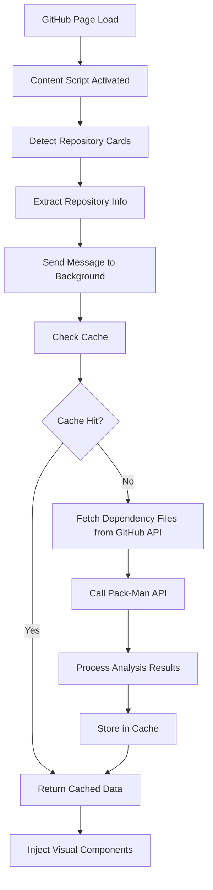

# Guia Completo: Extensão Chrome Pack-Man para Análise de Repositórios GitHub

## 📋 Visão Geral

Esta documentação descreve como criar uma extensão Chrome que integra com a aplicação Pack-Man para analisar dependências de repositórios GitHub em tempo real, fornecendo feedback visual diretamente na interface do GitHub.

### Como a Extensão Funciona

1. **Content Script** detecta quando você está em páginas de repositórios do GitHub
2. **Background Service Worker** gerencia cache e comunicação com a API do Pack-Man
3. **Visual Feedback** injeta badges/componentes diretamente nos cards dos repositórios
4. **Análise Automática** busca arquivos de dependências (package.json, requirements.txt, pubspec.yaml) e analisa com a API do Pack-Man

## 🏗️ Arquitetura dos Componentes

### Fluxo de Funcionamento


## 🔧 Componentes Principais

### 1. Manifest.json - Configuração Base

```json
{
  "manifest_version": 3,
  "name": "GitHub Repository Analyzer",
  "version": "1.0.0",
  "description": "Analyze GitHub repositories with external API integration",
  "permissions": [
    "activeTab",     // Acesso à aba ativa
    "storage",       // Armazenamento local para cache
    "scripting"      // Injeção de scripts
  ],
  "host_permissions": [
    "https://github.com/*",                    // Acesso ao GitHub
    "https://api.github.com/*",                // API do GitHub
    "https://pack-man-sand.vercel.app/*"       // API do Pack-Man
  ],
  "background": {
    "service_worker": "background.js"
  },
  "content_scripts": [
    {
      "matches": [
        "https://github.com/*?*tab=repositories*",
        "https://github.com/*/repositories*",
        "https://github.com/*?tab=repositories",
        "https://github.com/*/repositories",
        "https://github.com/*?*tab=repositories&*",
        "https://github.com/orgs/*/repositories*",
        "https://github.com/users/*/repositories*"
      ],
      "js": ["content.js"],
      "css": ["styles.css"],
      "run_at": "document_end"
    }
  ],
  "action": {
    "default_title": "Pack-Man GitHub Extension"
  },
  "icons": {
    "16": "icons/icon16.png",
    "48": "icons/icon48.png",
    "128": "icons/icon128.png"
  }
}
```

**Principais Configurações:**
- `manifest_version: 3` - Usa a versão mais recente do Chrome Extensions
- `host_permissions` - Define quais domínios a extensão pode acessar
- `content_scripts.matches` - URLs onde o content script será injetado
- `run_at: "document_end"` - Executa após o DOM estar carregado

### 2. Background.js - Service Worker

**Responsabilidades:**
- ✅ Gerenciar cache inteligente (5 minutos de expiração)
- ✅ Buscar arquivos de dependências do GitHub (package.json, requirements.txt, pubspec.yaml)
- ✅ Integrar com a API do Pack-Man para análise de dependências
- ✅ Processar resultados e estatísticas de pacotes
- ✅ Comunicar com content scripts via mensagens

**Estrutura Base:**
```javascript
class BackgroundService {
  constructor() {
    this.cache = new Map();
    this.cacheExpiry = 5 * 60 * 1000; // 5 minutos
    this.packManApiEndpoint = 'https://pack-man-sand.vercel.app/api/analyze-packages';
    this.githubApiBase = 'https://api.github.com';
    this.supportedFiles = ['package.json', 'requirements.txt', 'pubspec.yaml'];
    this.init();
  }

  init() {
    // Configurar listeners de mensagens
    chrome.runtime.onMessage.addListener((request, sender, sendResponse) => {
      this.handleMessage(request, sender, sendResponse);
      return true; // Manter canal aberto para resposta assíncrona
    });

    // Limpar cache expirado periodicamente
    setInterval(() => this.cleanCache(), 60000);
  }

  async handleMessage(request, sender, sendResponse) {
    try {
      switch (request.action) {
        case 'analyzeRepository':
          const result = await this.analyzeRepository(request.repoName);
          sendResponse({ success: true, data: result });
          break;

        case 'clearCache':
          this.cache.clear();
          sendResponse({ success: true });
          break;

        case 'getCacheStats':
          sendResponse({
            success: true,
            stats: {
              size: this.cache.size,
              entries: Array.from(this.cache.keys())
            }
          });
          break;

        default:
          sendResponse({ success: false, error: 'Ação desconhecida' });
      }
    } catch (error) {
      console.error('Erro no background service:', error);
      sendResponse({ success: false, error: error.message });
    }
  }

  async analyzeRepository(repoName) {
    // 1. Verificar cache primeiro
    const cached = this.getFromCache(repoName);
    if (cached) {
      return cached;
    }

    // 2. Buscar arquivos de dependências do GitHub
    const dependencyFile = await this.fetchDependencyFile(repoName);
    
    // 3. Analisar com a API do Pack-Man
    const analysisResult = await this.callPackManAPI(dependencyFile);

    // 4. Armazenar no cache
    this.setToCache(repoName, analysisResult);

    return analysisResult;
  }

  async fetchDependencyFile(repoName) {
    // Tenta buscar arquivos de dependências em ordem de prioridade
    for (const fileName of this.supportedFiles) {
      try {
        const response = await fetch(`${this.githubApiBase}/repos/${repoName}/contents/${fileName}`);
        if (response.ok) {
          const data = await response.json();
          return {
            content: atob(data.content),
            fileName: fileName
          };
        }
      } catch (error) {
        console.log(`Arquivo ${fileName} não encontrado em ${repoName}`);
      }
    }
    return null;
  }

  async callPackManAPI(dependencyFile) {
    if (!dependencyFile) {
      return { 
        hasData: false, 
        message: 'Nenhum arquivo de dependências encontrado',
        packages: [],
        summary: { total: 0, upToDate: 0, outdated: 0, errors: 0 }
      };
    }

    try {
      const response = await fetch(this.packManApiEndpoint, {
        method: 'POST',
        headers: { 'Content-Type': 'application/json' },
        body: JSON.stringify({
          content: dependencyFile.content,
          fileName: dependencyFile.fileName
        })
      });

      if (!response.ok) {
        throw new Error(`Pack-Man API request failed: ${response.status}`);
      }

      const result = await response.json();
      return {
        hasData: true,
        packages: result.packages || [],
        summary: result.summary || { total: 0, upToDate: 0, outdated: 0, errors: 0 },
        fileName: dependencyFile.fileName
      };
    } catch (error) {
      console.error('Erro ao chamar API do Pack-Man:', error);
      return { 
        error: true, 
        message: error.message,
        packages: [],
        summary: { total: 0, upToDate: 0, outdated: 0, errors: 0 }
      };
    }
  }

  // Métodos de cache
  getFromCache(key) {
    const cached = this.cache.get(key);
    if (!cached) return null;

    if (Date.now() - cached.timestamp > this.cacheExpiry) {
      this.cache.delete(key);
      return null;
    }

    return cached.data;
  }

  setToCache(key, data) {
    this.cache.set(key, {
      data: data,
      timestamp: Date.now()
    });
  }

  cleanCache() {
    const now = Date.now();
    for (const [key, value] of this.cache.entries()) {
      if (now - value.timestamp > this.cacheExpiry) {
        this.cache.delete(key);
      }
    }
  }
}

// Inicializar o serviço
const backgroundService = new BackgroundService();
```

### 3. Content.js - Detector de Repositórios

**Como Funciona:**
```javascript
class GitHubRepositoryAnalyzer {
  constructor() {
    this.processedRepos = new Set();
    this.observer = null;
    this.init();
  }

  init() {
    // Aguarda carregamento da página
    if (document.readyState === 'loading') {
      document.addEventListener('DOMContentLoaded', () => this.start());
    } else {
      this.start();
    }
  }

  start() {
    console.log('GitHub Repository Analyzer iniciado');
    
    // Processa repositórios existentes
    setTimeout(() => {
      this.scanRepositories();
    }, 1000);
    
    // Configura observer para mudanças dinâmicas
    this.setupMutationObserver();
  }

  scanRepositories() {
    const repoSelectors = [
      // Novos layouts do GitHub
      '[data-testid="repository-list-item"]',
      '[data-testid="repo-list-item"]',
      
      // Layouts clássicos
      '.repo-list-item',
      '.js-repo-list-item',
      
      // Baseados em estrutura
      '.Box-row',
      '.col-12.d-block.width-full.py-4.border-bottom'
    ];

    let foundRepos = new Set();

    repoSelectors.forEach(selector => {
      const elements = document.querySelectorAll(selector);
      elements.forEach(element => {
        if (this.isRepositoryCard(element)) {
          foundRepos.add(element);
        }
      });
    });

    console.log(`Encontrados ${foundRepos.size} repositórios`);

    foundRepos.forEach(repoCard => {
      if (!this.processedRepos.has(repoCard)) {
        this.processRepository(repoCard);
        this.processedRepos.add(repoCard);
      }
    });
  }

  isRepositoryCard(element) {
    // Verifica se o elemento contém características de um card de repositório
    const hasRepoLink = element.querySelector('a[data-hovercard-type="repository"]');
    const hasRepoName = element.querySelector('[itemprop="name"]');
    const hasDescription = element.querySelector('[itemprop="description"]');
    
    return hasRepoLink || hasRepoName;
  }

  processRepository(repoCard) {
    try {
      // 1. Extrai informações do repositório
      const repoInfo = this.extractRepositoryInfo(repoCard);
      if (!repoInfo.name) return;

      // 2. Cria container para badges
      const container = this.createBadgeContainer(repoCard);
      
      // 3. Adiciona indicador de carregamento
      this.showLoadingIndicator(container);
      
      // 4. Solicita análise ao background script
      chrome.runtime.sendMessage({
        action: 'analyzeRepository',
        repoName: repoInfo.name
      }, (response) => {
        if (response && response.success) {
          this.renderResults(container, response.data);
        } else {
          this.renderError(container, response?.error || 'Erro desconhecido');
        }
      });
      
    } catch (error) {
      console.error('Erro ao processar repositório:', error);
    }
  }

  extractRepositoryInfo(repoCard) {
    const repoLinkSelectors = [
      'a[data-hovercard-type="repository"]',
      'a[itemprop="name codeRepository"]',
      'h3 a',
      '.f3 a'
    ];
    
    for (const selector of repoLinkSelectors) {
      const repoLink = repoCard.querySelector(selector);
      if (repoLink) {
        const href = repoLink.getAttribute('href');
        if (href) {
          return {
            name: href.replace(/^\//, '').replace(/\/$/, ''),
            element: repoCard
          };
        }
      }
    }
    
    return { name: '', element: repoCard };
  }

  createBadgeContainer(repoCard) {
    // Procura locais ideais para inserir badges
    const targetSelectors = [
      '.f6.color-fg-muted.mt-2',      // Após metadados
      '.repo-list-description',        // Na descrição
      '.d-flex.flex-wrap'             // Na área de tags
    ];
    
    for (const selector of targetSelectors) {
      const target = repoCard.querySelector(selector);
      if (target) {
        let container = target.querySelector('.repo-analyzer-container');
        if (!container) {
          container = document.createElement('div');
          container.className = 'repo-analyzer-container';
          target.appendChild(container);
        }
        return container;
      }
    }
    
    // Fallback: adiciona no final do card
    const container = document.createElement('div');
    container.className = 'repo-analyzer-container';
    repoCard.appendChild(container);
    return container;
  }

  showLoadingIndicator(container) {
    container.innerHTML = `
      <div class="repo-analyzer-loading">
        <span class="spinner"></span>
        <span class="loading-text">Analisando...</span>
      </div>
    `;
  }

  renderResults(container, data) {
    if (data.error) {
      this.renderError(container, data.message);
      return;
    }

    if (!data.hasData) {
      this.renderNoData(container, data.message);
      return;
    }

    const badges = this.createBadges(data);
    container.innerHTML = `<div class="repo-analyzer-badges">${badges}</div>`;
    
    // Adiciona animação de entrada
    const badgeElements = container.querySelectorAll('.badge');
    badgeElements.forEach((badge, index) => {
      badge.style.animationDelay = `${index * 0.1}s`;
      badge.classList.add('fade-in');
    });
  }

  createBadges(data) {
    const badges = [];
    const { summary, fileName } = data;
    
    // Badge do tipo de arquivo
    const fileTypeMap = {
      'package.json': 'npm',
      'requirements.txt': 'pip', 
      'pubspec.yaml': 'pub'
    };
    const fileType = fileTypeMap[fileName] || 'unknown';
    badges.push(`<span class="badge badge-file-type">${fileType}</span>`);
    
    // Badges de status
    if (summary.outdated > 0) {
      badges.push(`<span class="badge badge-warning">${summary.outdated} outdated</span>`);
    }
    
    if (summary.errors > 0) {
      badges.push(`<span class="badge badge-error">${summary.errors} errors</span>`);
    }
    
    if (summary.upToDate > 0) {
      badges.push(`<span class="badge badge-success">${summary.upToDate} up-to-date</span>`);
    }
    
    // Se tudo estiver atualizado
    if (summary.outdated === 0 && summary.errors === 0 && summary.total > 0) {
      badges.push(`<span class="badge badge-success">✓ All up-to-date</span>`);
    }
    
    return badges.join('');
  }

  renderError(container, errorMessage) {
    container.innerHTML = `
      <div class="repo-analyzer-error">
        <span class="error-icon">⚠️</span>
        <span class="error-text">${errorMessage}</span>
      </div>
    `;
  }

  renderNoData(container, message) {
    container.innerHTML = `
      <div class="repo-analyzer-no-data">
        <span class="no-data-icon">📦</span>
        <span class="no-data-text">${message}</span>
      </div>
    `;
  }

  setupMutationObserver() {
    this.observer = new MutationObserver((mutations) => {
      mutations.forEach((mutation) => {
        if (mutation.type === 'childList') {
          mutation.addedNodes.forEach((node) => {
            if (node.nodeType === Node.ELEMENT_NODE) {
              const newRepos = node.querySelectorAll('[data-testid="repository-list-item"]');
              if (newRepos.length > 0) {
                setTimeout(() => this.scanRepositories(), 500);
              }
            }
          });
        }
      });
    });

    // Observa containers principais
    const containers = [
      '[data-testid="repository-list-container"]',
      'main',
      '[role="main"]'
    ];
    
    containers.forEach(selector => {
      const container = document.querySelector(selector);
      if (container) {
        this.observer.observe(container, { childList: true, subtree: true });
      }
    });
  }

  destroy() {
    if (this.observer) {
      this.observer.disconnect();
    }
    this.processedRepos.clear();
  }
}

// Inicializar a extensão
const analyzer = new GitHubRepositoryAnalyzer();

// Limpeza quando a página é recarregada
window.addEventListener('beforeunload', () => {
  analyzer.destroy();
});
```

## 🎨 Estilos CSS - styles.css

```css
/* Container principal para badges */
.repo-analyzer-container {
  margin-top: 8px;
  display: flex;
  flex-wrap: wrap;
  gap: 6px;
  align-items: center;
}

/* Badges principais */
.repo-analyzer-badges {
  display: flex;
  flex-wrap: wrap;
  gap: 6px;
}

.badge {
  display: inline-flex;
  align-items: center;
  padding: 3px 8px;
  font-size: 11px;
  font-weight: 600;
  border-radius: 12px;
  text-decoration: none;
  transition: all 0.3s ease;
  cursor: default;
  user-select: none;
  line-height: 1.2;
}

/* Badge específicos por tipo */
.badge-file-type {
  background: linear-gradient(135deg, #6f42c1, #5a32a3);
  color: white;
}

.badge-warning {
  background: linear-gradient(135deg, #fd7e14, #e8590c);
  color: white;
}

.badge-error {
  background: linear-gradient(135deg, #dc3545, #c82333);
  color: white;
  animation: pulse 2s infinite;
}

.badge-success {
  background: linear-gradient(135deg, #28a745, #20c997);
  color: white;
}

/* Loading indicator */
.repo-analyzer-loading {
  display: flex;
  align-items: center;
  gap: 6px;
  color: #586069;
  font-size: 11px;
  padding: 4px 8px;
  background: rgba(255, 255, 255, 0.8);
  border-radius: 12px;
  border: 1px solid rgba(0, 0, 0, 0.1);
}

.spinner {
  width: 12px;
  height: 12px;
  border: 2px solid #e1e4e8;
  border-top: 2px solid #0969da;
  border-radius: 50%;
  animation: spin 1s linear infinite;
}

/* Error indicator */
.repo-analyzer-error {
  display: flex;
  align-items: center;
  gap: 6px;
  color: #dc3545;
  font-size: 11px;
  padding: 4px 8px;
}

/* No data indicator */
.repo-analyzer-no-data {
  display: flex;
  align-items: center;
  gap: 6px;
  color: #6c757d;
  font-size: 11px;
  padding: 4px 8px;
}

.error-icon,
.no-data-icon {
  font-size: 12px;
}

/* Animações */
@keyframes spin {
  0% { transform: rotate(0deg); }
  100% { transform: rotate(360deg); }
}

@keyframes pulse {
  0%, 100% { box-shadow: 0 0 0 0 rgba(220, 53, 69, 0.4); }
  50% { box-shadow: 0 0 0 4px rgba(220, 53, 69, 0.1); }
}

.fade-in {
  animation: fadeIn 0.5s ease-out;
}

@keyframes fadeIn {
  from { opacity: 0; transform: translateY(-10px); }
  to { opacity: 1; transform: translateY(0); }
}

/* Responsividade */
@media (max-width: 768px) {
  .repo-analyzer-container {
    margin-top: 6px;
    gap: 4px;
  }
  
  .badge {
    padding: 2px 6px;
    font-size: 10px;
  }
}
```

## 🎛️ Interface do Popup

### popup.html
```html
<!DOCTYPE html>
<html>
<head>
  <meta charset="UTF-8">
  <title>GitHub Repository Analyzer</title>
  <style>
    body {
      width: 350px;
      padding: 20px;
      font-family: -apple-system, BlinkMacSystemFont, 'Segoe UI', sans-serif;
    }
    
    .status-card {
      background: white;
      border: 1px solid #e1e4e8;
      border-radius: 8px;
      padding: 16px;
      margin-bottom: 12px;
    }
    
    .status-label {
      font-size: 12px;
      color: #586069;
      margin-bottom: 4px;
    }
    
    .status-value {
      font-size: 16px;
      font-weight: 600;
    }
    
    .status-active { color: #28a745; }
    .status-inactive { color: #dc3545; }
    
    .button {
      background: #0969da;
      color: white;
      border: none;
      padding: 8px 16px;
      border-radius: 6px;
      cursor: pointer;
      font-size: 12px;
      margin-right: 8px;
    }
    
    .button:hover {
      background: #0860ca;
    }
    
    .cache-stats {
      display: grid;
      grid-template-columns: 1fr 1fr;
      gap: 8px;
      margin: 12px 0;
    }
  </style>
</head>
<body>
  <div class="status-card">
    <div class="status-label">Status da Extensão</div>
    <div class="status-value status-active">Ativa</div>
  </div>
  
  <div class="status-card">
    <div class="status-label">Página Atual</div>
    <div class="status-value" id="current-page">Verificando...</div>
  </div>
  
  <div class="status-card">
    <div class="status-label">Estatísticas do Cache</div>
    <div class="cache-stats">
      <div>
        <div class="status-label">Items</div>
        <div class="status-value" id="cache-size">0</div>
      </div>
      <div>
        <div class="status-label">Última Atualização</div>
        <div class="status-value" id="last-updated">Nunca</div>
      </div>
    </div>
  </div>
  
  <div>
    <button class="button" id="refresh-btn">Atualizar</button>
    <button class="button" id="clear-btn">Limpar Cache</button>
  </div>
  
  <script src="popup.js"></script>
</body>
</html>
```

### popup.js
```javascript
class PopupManager {
  constructor() {
    this.init();
  }

  init() {
    this.updateCurrentPage();
    this.updateCacheStats();
    this.setupEventListeners();
  }

  async updateCurrentPage() {
    try {
      const [tab] = await chrome.tabs.query({ active: true, currentWindow: true });
      const pageElement = document.getElementById('current-page');
      
      if (tab && tab.url && tab.url.includes('github.com') && 
          (tab.url.includes('repositories') || tab.url.includes('tab=repositories'))) {
        pageElement.textContent = 'Página de Repositórios';
        pageElement.className = 'status-value status-active';
      } else {
        pageElement.textContent = 'Página Não Suportada';
        pageElement.className = 'status-value status-inactive';
      }
    } catch (error) {
      document.getElementById('current-page').textContent = 'Erro';
    }
  }

  async updateCacheStats() {
    try {
      const response = await chrome.runtime.sendMessage({ action: 'getCacheStats' });
      
      if (response && response.success) {
        document.getElementById('cache-size').textContent = response.stats.size;
        document.getElementById('last-updated').textContent = 'Agora mesmo';
      }
    } catch (error) {
      document.getElementById('cache-size').textContent = 'Erro';
    }
  }

  setupEventListeners() {
    document.getElementById('refresh-btn').addEventListener('click', () => {
      this.updateCacheStats();
    });

    document.getElementById('clear-btn').addEventListener('click', async () => {
      try {
        await chrome.runtime.sendMessage({ action: 'clearCache' });
        this.updateCacheStats();
      } catch (error) {
        console.error('Erro ao limpar cache:', error);
      }
    });
  }
}

document.addEventListener('DOMContentLoaded', () => {
  new PopupManager();
});
```

## 🚀 Instalação e Configuração

### Pré-requisitos
- Chrome 88+ ou navegador baseado em Chromium
- Acesso à internet para chamadas de API
- API do Pack-Man disponível em `https://pack-man-sand.vercel.app`
- Token do GitHub (opcional, para aumentar rate limits)

### Preparação do Ambiente
1. Crie uma pasta para sua extensão
2. Adicione todos os arquivos listados acima
3. Crie uma pasta `icons/` com ícones de 16x16, 48x48 e 128x128 pixels
4. Configure as URLs da API conforme necessário

### Configuração
```javascript
// config.js
const CONFIG = {
  PACK_MAN_API: 'https://pack-man-sand.vercel.app/api/analyze-packages',
  GITHUB_API_BASE: 'https://api.github.com',
  SUPPORTED_FILES: ['package.json', 'requirements.txt', 'pubspec.yaml'],
  CACHE_DURATION: 5 * 60 * 1000, // 5 minutos
  MAX_RETRIES: 3,
  TIMEOUT: 15000, // 15 segundos para API do Pack-Man
  GITHUB_TIMEOUT: 10000 // 10 segundos para GitHub API
};
```

### Variáveis de Ambiente
```javascript
// Para desenvolvimento local
const DEV_CONFIG = {
  PACK_MAN_API: 'http://localhost:3000/api/analyze-packages',
  DEBUG: true
};
```

### Instalação no Chrome
1. Abra `chrome://extensions/`
2. Ative o "Modo do desenvolvedor" (toggle no canto superior direito)
3. Clique em "Carregar sem compactação"
4. Selecione a pasta da sua extensão

### Teste da Funcionalidade
1. Navegue para uma página de repositórios no GitHub:
   - `https://github.com/username?tab=repositories`
   - `https://github.com/org/repositories`
2. Observe os badges sendo adicionados aos cards dos repositórios
3. Clique no ícone da extensão para ver o popup com estatísticas
4. Teste o cache limpando e recarregando a página

## 🔍 Debugging e Desenvolvimento

### Console do Background Script
```javascript
// No DevTools da extensão
chrome.runtime.getBackgroundPage((backgroundPage) => {
  console.log(backgroundPage.backgroundService);
});
```

### Debug do Content Script
```javascript
// Adicione logs detalhados
console.log('Repositórios encontrados:', foundRepos.size);
console.log('Seletores testados:', repoSelectors);
```

### Monitoramento de Performance
```javascript
// Meça tempo de execução
console.time('Repository Scan');
this.scanRepositories();
console.timeEnd('Repository Scan');
```

## 🎯 Customização para Sua API

### Adaptando a Integração
1. **Altere o endpoint da API** em `background.js`:
   ```javascript
   this.apiEndpoint = 'https://sua-api.com/analyze';
   ```

2. **Modifique a estrutura de dados** enviada:
   ```javascript
   body: JSON.stringify({
     repository: repoName,
     files: githubData,
     options: { /* suas opções */ }
   })
   ```

3. **Adapte a renderização** dos resultados:
   ```javascript
   createBadges(data) {
     // Customize baseado na resposta da sua API
   }
   ```

## 📝 Considerações Importantes

### Limitações da API do GitHub
- Rate limit: 60 requisições por hora para usuários não autenticados
- 5000 requisições por hora para usuários autenticados

### Limitações da API do Pack-Man
- A extensão depende da disponibilidade da API do Pack-Man
- Possíveis limites de taxa específicos da API
- Timeout adequado para chamadas à API do Pack-Man
- Implementar tratamento de erro robusto para falhas de rede

### Performance
- Use cache inteligente para evitar requisições desnecessárias
- Implemente debouncing para scroll infinito
- Processe apenas repositórios visíveis
- Considerar modo offline ou cache para funcionalidade básica

### Segurança
- Valide todas as entradas antes de enviar para a API do Pack-Man
- Sanitizar dados recebidos da API antes de exibir no DOM
- Use HTTPS para todas as requisições
- Verificar certificados SSL nas chamadas HTTPS
- Não armazene dados sensíveis no cache

## 🧪 Testes

### Testes Unitários
```javascript
// test/background.test.js
describe('Background Script', () => {
  test('should analyze repository correctly', async () => {
    const mockRepo = {
      owner: 'test-owner',
      name: 'test-repo'
    };
    
    const result = await analyzeRepository(mockRepo);
    expect(result).toHaveProperty('summary');
    expect(result).toHaveProperty('packages');
  });

  test('should handle Pack-Man API errors', async () => {
    // Mock API failure
    global.fetch = jest.fn().mockRejectedValue(new Error('API Error'));
    
    const result = await callPackManAPI('invalid content', 'package.json');
    expect(result.error).toBe(true);
  });
});
```

### Testes de Integração
```javascript
// test/integration.test.js
describe('Pack-Man API Integration', () => {
  test('should fetch and analyze dependency file', async () => {
    const mockPackageJson = JSON.stringify({
      dependencies: { "react": "^17.0.0" }
    });
    
    const result = await callPackManAPI(mockPackageJson, 'package.json');
    expect(result.packages).toBeDefined();
    expect(result.summary).toBeDefined();
  });

  test('should handle GitHub API rate limiting', async () => {
    // Test rate limiting scenarios
    const result = await fetchDependencyFile('owner', 'repo', 'package.json');
    // Should handle gracefully
  });
});
```

### Testes E2E
```javascript
// test/e2e.test.js
describe('Extension E2E', () => {
  test('should display badges on GitHub repository page', async () => {
    await page.goto('https://github.com/facebook/react');
    await page.waitForSelector('.repo-analyzer-badges');
    
    const badges = await page.$$('.badge');
    expect(badges.length).toBeGreaterThan(0);
  });
});
```

## 🔄 Versionamento e Distribuição

### Estrutura de Versionamento
- Seguir Semantic Versioning (SemVer)
- Atualizar `manifest.json` a cada release
- Manter changelog detalhado
- Versionar junto com a API do Pack-Man quando necessário

### Preparação para Chrome Web Store
1. Crie ícones de alta qualidade (16, 48, 128px)
2. Adicione screenshots da extensão em funcionamento
3. Escreva descrição detalhada
4. Configure política de privacidade se necessário

### Distribuição
1. **Chrome Web Store**: Processo oficial de publicação
2. **Distribuição Privada**: Para organizações específicas
3. **Sideloading**: Para desenvolvimento e testes

## 📊 Monitoramento e Logs

### Sistema de Logs
```javascript
// logger.js
class Logger {
  static log(level, message, data = {}) {
    const timestamp = new Date().toISOString();
    const logEntry = {
      timestamp,
      level,
      message,
      data,
      url: window.location?.href
    };
    
    console[level](logEntry);
    
    // Enviar para serviço de monitoramento se configurado
    if (CONFIG.MONITORING_ENABLED) {
      this.sendToMonitoring(logEntry);
    }
  }
  
  static error(message, error) {
    this.log('error', message, { error: error.message, stack: error.stack });
  }
  
  static info(message, data) {
    this.log('info', message, data);
  }
}
```

### Métricas de Performance
```javascript
// metrics.js
class Metrics {
  static trackApiCall(endpoint, duration, success) {
    const metric = {
      endpoint,
      duration,
      success,
      timestamp: Date.now()
    };
    
    Logger.info('API Call Metric', metric);
  }
  
  static trackUserAction(action, context) {
    Logger.info('User Action', { action, context });
  }
}
```

### Estrutura Final do Projeto
```
minha-extensao/
├── manifest.json
├── background.js
├── content.js
├── popup.html
├── popup.js
├── styles.css
├── config.js
├── logger.js
├── metrics.js
├── icons/
│   ├── icon16.png
│   ├── icon48.png
│   └── icon128.png
├── test/
│   ├── background.test.js
│   ├── integration.test.js
│   └── e2e.test.js
├── docs/
│   └── API_INTEGRATION.md
└── README.md
```

Esta documentação fornece uma base sólida para criar extensões Chrome robustas que interagem com GitHub e APIs externas, mantendo boa performance e experiência do usuário.

## 🎯 Conclusão

Esta extensão Chrome integra perfeitamente com a API do Pack-Man para fornecer análise em tempo real de dependências diretamente nas páginas de repositórios do GitHub. A arquitetura modular permite fácil manutenção e extensibilidade.

### Principais Benefícios
- **Integração Seamless**: Funciona nativamente com a interface do GitHub
- **Análise Poderosa**: Utiliza a API robusta do Pack-Man
- **Performance Otimizada**: Cache inteligente e debouncing
- **Experiência do Usuário**: Feedback visual claro e intuitivo

### Próximos Passos
1. **Implementar autenticação GitHub** para repositórios privados
2. **Adicionar suporte a mais tipos de arquivo** (Gemfile, composer.json, etc.)
3. **Implementar notificações** para atualizações críticas
4. **Adicionar configurações do usuário** (preferências de exibição)
5. **Integrar com GitHub Actions** para CI/CD

### Recursos Adicionais
- [Documentação da API do Pack-Man](https://pack-man-sand.vercel.app/api)
- [GitHub API Documentation](https://docs.github.com/en/rest)
- [Chrome Extension Development](https://developer.chrome.com/docs/extensions/)
- [Manifest V3 Migration Guide](https://developer.chrome.com/docs/extensions/migrating/)

## 📚 Arquivos de Referência do Projeto Pack-Man

Para implementar a extensão Chrome, consulte os seguintes arquivos do projeto principal que contêm funcionalidades relacionadas ao GitHub:

### 🔧 Componentes e UI
- **`components/package-checker/GitHubUrlInput.tsx`** - Componente de input para URLs do GitHub com validação
- **`components/github-token-config.tsx`** - Configuração de token do GitHub

### 🛠 Utilitários e Helpers
- **`utils/github-url-utils.ts`** - Funções para parsing e validação de URLs do GitHub
- **`lib/github-service.ts`** - Serviço principal para integração com a API do GitHub
- **`lib/package-services.ts`** - Serviços para análise de diferentes tipos de pacotes

### 📝 Tipos e Interfaces
- **`types/github.ts`** - Definições de tipos para dados do GitHub
- **`types/package.ts`** - Interfaces para informações de pacotes e análises

### 🎣 Hooks Customizados
- **`hooks/use-github-repository.ts`** - Hook para gerenciar dados de repositórios GitHub
- **`hooks/use-github-token.ts`** - Hook para gerenciar autenticação GitHub
- **`hooks/use-package-analysis.ts`** - Hook para análise de pacotes

### 📄 Documentação Adicional
- **`docs/GITHUB_TOKEN_SETUP.md`** - Guia de configuração de token GitHub
- **`docs/GITHUB_TOKEN_TROUBLESHOOTING.md`** - Solução de problemas com tokens
- **`API.md`** - Documentação da API do Pack-Man
- **`WARP.md`** - Detalhes técnicos da implementação

### 🧪 Testes e Exemplos
- **`test-api.js`** - Script de teste da API
- **`test-github-token.js`** - Teste de configuração de token GitHub

### 💡 Dicas de Implementação

1. **Reutilização de Código**: Muitas funções dos arquivos `utils/github-url-utils.ts` e `lib/github-service.ts` podem ser adaptadas para uso na extensão

2. **Tipos TypeScript**: Use as interfaces definidas em `types/github.ts` e `types/package.ts` como referência para manter consistência

3. **Padrões de API**: Consulte `lib/package-services.ts` para entender como diferentes tipos de arquivos de dependência são processados

4. **Tratamento de Erros**: Veja `hooks/use-github-repository.ts` para padrões de tratamento de erros da API do GitHub

5. **Autenticação**: Consulte `components/github-token-config.tsx` e `hooks/use-github-token.ts` para implementar autenticação opcional na extensão

---

**Nota**: Este guia fornece uma implementação completa para uma extensão Chrome que integra com a API do Pack-Man. A arquitetura é escalável e pode ser adaptada para diferentes necessidades e casos de uso.
